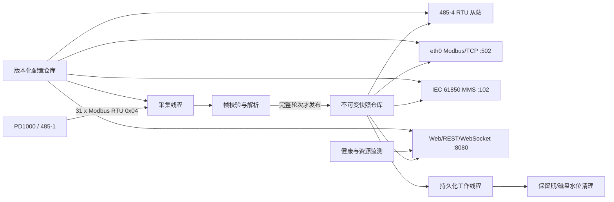

# 总体架构

## 1. 选型结论

目标机上运行一个 C++17 产品守护进程 `uhf-gatewayd`，把协议、Web、存储和健康管理放在同一发布单元中，但通过明确接口隔离；另有一个极小、接口固定的 root 特权服务只负责网络事务和维护枚举动作。浏览器负责 PRPD/PRPS 绘图；目标机不运行 Node.js、容器、关系数据库或服务端图像渲染。

推荐依赖：

| 能力 | 选型 | 原因与约束 |
|---|---|---|
| 构建 | CMake + aarch64 交叉工具链 | 目标板只有约 481 MiB 内存，不在板上做常规构建 |
| Modbus | 候选 libmodbus 3.2.0 | C 库、支持 RTU/TCP 主从、高地址映射和 RS-485；LGPL-2.1-or-later |
| IEC 61850 | `IIec61850Server` 适配层；libIEC61850 1.6.2 | C99、适合嵌入式、支持 MMS 服务端；项目按 GPLv3 兼容方式开源 |
| Web | 候选 CivetWeb v1.16，裁剪 Lua/CGI/WebDAV 等非必要特性 | 可嵌入 C/C++、MIT、支持静态文件、REST 和 WebSocket |
| JSON | nlohmann/json 固定版本 | 配置和 API；MIT，头文件集成 |
| 加密 | 系统 OpenSSL 3 | PBKDF2/HMAC、随机数和可选 HTTPS；不自制密码算法 |
| 前端 | 原生 HTML/CSS/ES modules + 本地 ECharts 固定版本 | 构建产物是静态文件，图表计算放在客户端 |
| 日志 | `syslog(3)` + rsyslog + logrotate | 板上已有成熟组件；避免再引入日志守护进程 |
| 测试 | Catch2/CTest + Python 协议模拟器（仅研发机） | 单元、伪终端、TCP 和故障注入 |

以上版本是 2026-08-30 官方发布页的候选基线；libIEC61850 1.6.2 是包含漏洞和缺陷修复的当前维护版。WP0 必须完成交叉构建、回归和许可证审计后固定 tag/commit、记录 SHA-256，若变更则记录理由。不得在目标机启动时下载依赖或前端资源。

官方选型依据：

- [libmodbus 官方参考](https://libmodbus.org/reference/)
- [libmodbus 高地址映射](https://libmodbus.org/reference/modbus_mapping_new_start_address/)
- [libIEC61850 官方仓库及许可说明](https://github.com/mz-automation/libiec61850)
- [libIEC61850 服务端 API](https://support.mz-automation.de/doc/libiec61850/c/latest/group__IEC61850__SERVER__GENERAL.html)
- [IEC 61850-7-4 逻辑节点和数据对象标准](https://webstore.iec.ch/en/publication/66551)
- [CivetWeb 官方仓库](https://github.com/civetweb/civetweb)

## 2. 运行时结构



### 2.1 线程与责任

| 组件 | 责任 | 不得做的事 |
|---|---|---|
| `AcquisitionEngine` | 独占 485-1、31 笔轮询、校验、重试、6 秒截止 | 不写磁盘、不等待网络客户端 |
| `SnapshotStore` | 原子发布/读取不可变快照，保存 last-good 与质量 | 不持有串口或 socket |
| `ModbusRtuServer` | 独占 485-4，处理 `0x04` 与标准异常 | 不触发下位机同步读取 |
| `ModbusTcpServer` | 多客户端 TCP 服务，按请求快照回复 | 不阻塞采集线程 |
| `Iec61850Server` | 更新 5 个点、质量和时间戳，管理 MMS 客户端 | 不把谱图放进模型，不反向控制采集 |
| `WebServer` | 登录、静态资源、REST、WebSocket、输入验证 | 不直接用 shell 拼接用户参数 |
| `PersistenceWorker` | 周期/事件帧、CSV 导出、清理和磁盘水位 | 不在采集临界路径 `fsync` |
| `HealthSupervisor` | 组件状态、资源、watchdog 心跳和告警聚合 | 不直接占用硬件 watchdog |

线程间只传递值对象、事件和不可变快照。每个网络服务使用独立的 libmodbus 映射或按请求复制当前快照，避免共享可变库结构的数据竞争。

## 3. 快照与状态模型

```text
Snapshot
  generation: uint64
  acquisition_started_at / completed_at: UTC timestamp
  duration_ms: uint32
  payload_state: good | degraded | not_refreshed
  raw_input_registers[3615]: uint16
  valid_blocks[31]: bool
  measurements: 5 typed fields + valid[5]
  spectrum[3600]: int16 view over raw registers
  spectrum_valid[3600]: bool/bitset
  error_summary: bounded enum/counters, no unbounded strings

AcquisitionStatus
  availability: fresh | stale | invalid
  last_attempt_at / result / bounded error
```

- `good`：31 块完整且不是全域占位。
- `not_refreshed`：完整读到且全部谱图点是 `0xFFBC`；该状态优先于 `degraded`，但任何测量点 invalid 仍保留在逐点质量中。
- `degraded`：不是全域 `0xFFBC`，但一个或多个测量值越界，或谱图含 `0xFFBA` 无效点。
- `fresh`：最近一次采集成功；`stale`：最近一次采集失败但仍有完整快照；`invalid`：启动后没有任何完整快照。

采集线程在本地构建候选快照，31 块传输完整后一次原子交换；每轮结束都原子更新独立的 `AcquisitionStatus`。对外 `ServingView` 组合最后完整快照与最新状态，因此失败轮次可变为 stale 而无需修改或伪造快照。对外组件只读取同一 generation 和状态版本，不能读到半轮数据。透明 Modbus 使用最后完整的原始寄存器；Web、IEC 和事件规则同时读取新鲜度与逐点质量。谱图原始码 `0xFFBA` 始终把对应 validity 置 false，即使其 int16 数值等于 -70。

## 4. 采集调度

1. 用 `CLOCK_MONOTONIC` 生成每 6 秒一次的轮次时间基准；时间戳另取同步后的 `CLOCK_REALTIME`。
2. 每笔使用 libmodbus `modbus_read_input_registers(address, count)`，请求计划只保存地址与数量；关闭 byte timeout，使 response timeout 约束完整响应，并禁用 libmodbus 自动 error-recovery 睡眠/重连。
3. `t3.5 = max(1.75 ms, 3.5×10/115200 s)`；正常成功路径也从响应最后停止位后等待该间隔再发送下一请求。实现以单调时钟保守计时，实机用逻辑分析仪证明最短空闲时间不少于 1.75 ms。
4. 单笔正常完整响应超时建议 150 ms。每次调用前把 response timeout 设为 `min(150ms, round_deadline-now)`。只有完整收齐且边界明确的 Modbus 异常帧或预期长度 CRC 错帧，才可在同一地址最多重试 3 次、间隔 `max(100 ms,t3.5)`；超时、短帧、长度/边界错误不重试。
5. 整轮用绝对 6 秒截止时间；任何一次库调用都不能获得超过剩余时间的超时。发生超时、短帧或边界错误即进入 `QUARANTINE`：放弃整轮、持续 drain，取得连续 6 秒无接收字节后才从 10001 开始新轮，任一字节重置静默计时。隔离期不发送请求，不解析候选响应。
6. RTU 没有事务号，有限静默窗不能防御无限迟到设备；ACCEPTANCE-HARDWARE 必须用 150 ms、6 秒边界和更迟注入证明 PD1000 的最迟响应界限小于隔离窗。若实机违反，不得靠猜地址上线，应延长隔离或修改下位机协议。
7. 单元测试构造原始帧并验证 31 个 CRC 与需求书表格完全一致；实机抓包锁定线地址 10001，而不是某些 SCADA 显示编号对应的 10000。模拟器覆盖正常帧间静默、逐字节慢滴、截止后迟到帧、隔离计时重置和残帧拼接。
8. CRC、地址、功能码、长度、Modbus 异常、超时和隔离分别计数；日志使用节流，恢复时输出一次恢复事件。

## 5. 协议服务

### 5.1 Modbus

- 使用 `modbus_mapping_new_start_address` 把输入寄存器起点设为 10001、长度 3615，避免为 0–10000 分配无用内存。
- README/UI 给出 SCADA 地址换算警告；收到 10000 时返回非法地址，不做有歧义的双地址别名。
- 仅 `0x04` 可读；写功能全部返回非法功能。
- TCP 服务绑定配置指定的 eth0 地址而不是无条件 `0.0.0.0`。
- Modbus/TCP Unit ID 独立配置为 1–247、默认 1；请求不匹配时返回异常 `0x0B`。测试覆盖匹配、错配、0、247 和跨客户端行为。
- 每个连接设置请求超时、响应上限和空闲超时；连接数默认上限 16。
- RTU 与 TCP 都返回当前 last-good 原始 uint16，保持有符号值的线上二进制不变。

### 5.2 IEC 61850

先定义稳定的适配接口：

```text
start(model_config, bind_address, port)
publish(measurements, quality, timestamp)
health()
stop()
```

V1 使用固定、通用且可被普通 IEC 61850 客户端浏览的模型：

- IED 名默认 `UHFPD1`，可在网页修改；LD 固定为 `PDMON`，避免配置后数据引用整体变化。
- `LLN0`、`LPHD1` 提供通用设备和健康信息。
- `SPDC1.UhfPaDsch`（MV）映射 10003 峰值 dBm；`SPDC1.PaDschAlm`（SPS）映射 V1 事件门限状态。
- `GGIO1.AnIn1`（MV）= 10001 平均 dBm，`IntIn1`（INS）= 10002 次/秒，`AnIn2`（MV）= 10003 峰值 dBm，`AnIn3`（MV）= 10004 相位 °，`AnIn4`（MV）= 10005 背景 mV。
- 每个值带 `q`、`t`；一个静态数据集 `LLN0.DSMeasurements` 和一个 URCB `LLN0.RPMeasurements`，使用数据变化触发及 60 秒完整性周期。
- 仓库保存源 SCL/ICD 和生成步骤；GGIO 的 `d`/单位描述写清业务语义。普通客户端不需要项目私有解析即可浏览；认识 SPDC 的客户端还能直接看到标准 UHF 局放量。

V1 不实现 BRCB、控制、写服务、GOOSE、SV、MMS 文件服务、动态数据集和 IEC TLS。IEC 资源合同：同时 MMS 连接最多 4；构建时把 `CONFIG_MMS_MAXIMUM_PDU_SIZE` 固定为 16 KiB，每连接最多 2 个 outstanding 服务、64 KiB 发送/URCB 待处理字节，整个 IEC 适配层动态内存预算 8 MiB。BER 解析深度上限 32、单请求数据元素上限 512；若协议栈不能强制任一限制，WP6 必须补受测边界或更换栈。超限请求拒绝/中止关联并计数，不能排入无界队列。

## 6. Web API 与页面

### 6.1 路由

| 方法 | 路径 | 登录 | 说明 |
|---|---|---|---|
| GET | `/login` | 否 | 登录页 |
| POST | `/api/v1/session` | 否 | 登录，限速并校验同源 Origin |
| DELETE | `/api/v1/session` | 是+CSRF | 注销 |
| GET | `/healthz` | 否 | 仅返回 up/degraded/down 与版本，不泄露配置 |
| GET | `/api/v1/health` | 是 | 组件、资源、最后轮询、协议客户端数 |
| GET | `/api/v1/snapshot/latest` | 是 | 最新快照和 3600 点 |
| GET | `/api/v1/config` | 是 | 脱敏配置和 schema |
| PUT | `/api/v1/config` | 是+CSRF | 带 `If-Match` 版本的配置修改 |
| POST | `/api/v1/network/stage` | 是+CSRF+再认证 | 验证并试应用网络配置 |
| POST | `/api/v1/network/confirm` | 是+CSRF | 在 60 秒内确认，否则自动回滚 |
| GET | `/api/v1/logs` | 是 | 受限条数、级别、组件过滤 |
| GET | `/api/v1/frames` | 是 | 历史索引 |
| GET | `/api/v1/frames/{id}.csv` | 是 | 流式导出一帧 |
| PUT | `/api/v1/tls` | 是+CSRF+再认证 | 校验并原子替换服务端证书/私钥 |
| POST | `/api/v1/maintenance/restart-service` | 是+CSRF+再认证 | POST，不使用 GET |
| POST | `/api/v1/maintenance/reboot` | 是+CSRF+再认证 | 固定 helper，不能传 shell 命令 |
| WS | `/ws/v1/telemetry` | 是 | 快照和健康事件 |

所有 JSON 请求体默认最大 64 KiB；TLS 上传使用专用 multipart 路由、总上限 96 KiB；所有响应也有路由级大小或流式上限，谱图最大固定 3600 点。CivetWeb 工作线程固定为 8，HTTP 活跃请求上限 16，已认证 WebSocket 上限 4；WebSocket 握手必须校验同源 `Origin`。每个 WS 只排队“一份最新快照”（≤128 KiB），新 generation 覆盖未发送旧 generation，慢浏览器不会累积消息。服务端对 HTML、日志、文件名和错误消息做转义，不把内部路径或堆栈发给浏览器。

产品模式默认在 `web.port=8080` 上启用 HTTPS。安装器生成带当前 IP/设备名 SAN 的自签名证书用于首次接入；管理员上传的 PEM 证书链和私钥各限 32 KiB，服务端校验证书期限、用途、SAN、私钥匹配与可解析性后写临时文件、`fsync`、原子替换并热重载，失败保持旧证书。私钥 0600、从不回传或记录；旧证书保留一份以便回滚。HTTP 兼容模式只能从本机 root 恢复配置启用，不能通过远程 Web 打开，并持续显示警告。

### 6.2 前端布局

- 沿用旧站点的蓝色主色和卡片式导航，但实时页采用需求书截图中的深色图表区。
- 顶部持续显示设备名、采集状态、最后成功时间和当前用户。
- 5 个测量卡后紧跟 PRPD/PRPS；浏览器在 Web Worker 或主线程节流渲染，服务端只传数值。
- 设置页按“网络、采集与转发、IEC 61850、存储、日志、安全”分组；字段显示范围、默认值和生效方式。
- 网络试应用后显示明确倒计时和新地址链接；未确认自动回滚。
- 所有图标和 JS/CSS 本地化，离线可用；基本功能在 1280×720 和移动端可操作。

## 7. 配置与特权边界

主守护进程以 `uhfgateway` 用户运行，加入 `dialout` 组，并仅保留绑定低端口所需的 `CAP_NET_BIND_SERVICE`。它不能写 `/etc`、执行 shell 或直接重启系统。root 只读默认在 `/etc/uhf-gateway`；运行配置和账号哈希在服务私有的 `/var/lib/uhf-gateway`，可由主进程原子更新。

需要 root 的操作由独立 `uhf-privileged.service` 完成。它通过 root 所有、组受限的 Unix socket 接收固定 schema 消息，使用 `SO_PEERCRED` 校验调用者，并再次验证全部字段；主服务保持 `NoNewPrivileges=true`，不通过子进程 sudo/setuid 提权。

1. `network.stage/confirm/rollback`：只读取 root-owned 事务文件，自行校验接口名、模式、IP、掩码、单默认网关和 DNS；接口名只允许 `eth0/eth1`。静态 stage 保留旧地址/路由，新地址只作辅助地址；confirm 才 make-before-break 提交。
2. `maintenance.restart-service/reboot`：只接受枚举动作，不接受任意命令和参数。

DHCP stage 使用板上已确认存在的 `dhclient` 和随发布包安装的 root-owned 固定 hook；hook 只把 OFFER/BOUND 写入事务服务，不运行发行版任意脚本。15 秒内取租失败则原样回滚；成功后 helper 把租约地址作为辅助地址、候选默认路由使用更差 metric，并在页面返回实际地址/租期。confirm 后才原子写入 `/etc/htnet` 的 DHCP 模式并接管续租；rollback 终止候选 PID、删除候选地址/路由/lease 并恢复旧文件。续租、NAK、地址变化和无 DHCP 服务器都必须故障注入。

特权服务和协议文件为 root 所有、不可由服务用户修改。网络事务包含旧配置、候选配置、Linux boot ID、stage 时 `CLOCK_BOOTTIME`、boottime 截止、状态和校验和。同一 boot ID 内只以 boottime 截止为准，RTC/NTP 前后跳均不改变 60 秒；服务重启继续原截止。候选应用成功时同时启动独立的 `uhf-network-rollback.timer`，其固定 root helper 在截止时直接读取事务并回滚，不依赖主守护进程或特权 socket 服务仍存活；主特权服务自身也用 `timerfd(CLOCK_BOOTTIME)` 执行同一幂等动作。boot ID 改变、事务损坏或截止无法证明时，`uhf-network-recovery.service` 在网络服务启动前立即回滚，不在新开机周期继续等待。审计记录旧/新配置摘要、用户、结果和回滚原因，不记录密码或会话令牌。任何动作都不得 stop/restart frpc、4G、sysrst 或硬件 watchdog。

板卡启动使用 `/etc/htnet/ifconfig-eth0`、`ifconfig-eth1` 和 `/etc/net.conf`/`net2.conf`。新 helper 应封装这些板级差异，业务代码不得直接依赖旧 `/data/modify_net*.sh`，因为旧脚本会立即重启且缺少服务端校验。

## 8. 日志、数据与健康

### 8.1 日志

- 级别：DEBUG（默认关闭）、INFO、WARN、ERROR、CRITICAL。
- 组件：acquisition、modbus-rtu、modbus-tcp、iec61850、web、auth、config、storage、system。
- 每条包含 UTC 时间、单调序列、级别、组件、事件码、短消息和有限键值；不记录完整谱图、密码、Cookie、密钥或完整配置。
- 重复错误按事件码节流并带累计次数；链路恢复单独记录。
- rsyslog 写 `/var/log/uhf-gateway/gateway.log`；logrotate 默认 `daily`、`size 5M`、`rotate 7`、`compress`、`missingok`。
- Web 日志读取经过固定 API，不允许用户传文件路径。

### 8.2 数据帧

建议文件格式：

```text
magic/version/header_length
generation + UTC timestamp + monotonic duration + quality flags
5 typed measurements
3615 x uint16 big-endian canonical payload
CRC32
```

单帧约 7.3 KiB。每 5 分钟周期保存约 2.1 MiB/天；考虑两类事件分别按 60 秒窗口合并、每包最多 6 帧，极端持续触发的帧载荷仍小于约 130 MiB/天。默认 1 天保留对当前 4.2 GiB 可用空间安全，但仍必须执行水位清理。

V1 事件检测只读取 ServingView 中 fresh/valid 的 10003。强放电状态机初始 armed，达到 `-45 dBm` 触发，降到 `-50 dBm` 以下重新 armed。突变状态机比较当前峰值和内存中的上一次有效峰值，`abs(current-previous_valid) >= 10 dB` 触发；stale、invalid、not_refreshed 或峰值 invalid 均跳过且不替换基线，进程启动后的第一份有效值只建立基线。

内存保留最近 2 个完整 generation 的有界环。首次事件建立 `EventBundle`：复制前 2 帧和当前帧，并收集后续 3 个新完整 generation；30 秒超时后即使不足也停止收集并标记 partial。60 秒合并窗固定从首次触发计时，同类后续触发只更新 reason 对应的 `merged_count/max_peak/max_delta`，不追加超过 6 帧、不延长窗口。两类条件同轮成立共用一个 bundle 并保留两个 reason。bundle 先写 `.tmp`，帧收集完成后保留到 60 秒合并窗结束，再原子改名；进程重启清理未完成临时包并记录恢复日志。

清理状态机使用明确滞回：低水位 `max(storage.min_free_bytes（默认 512 MiB）, 10%)` 触发，恢复水位 `max(低水位+256 MiB, 15%)`。先删 TTL 已过期帧，再按时间删最旧的已关闭帧；保护当前正在写的 `.tmp`、最新一帧和非 frames 目录，启动时可清理确认无写者且超过 1 小时的遗留 `.tmp`。删除失败或保护对象外已无可删帧时进入 storage-critical、停止接受新持久化任务并计数丢弃，但不阻塞采集/协议；每小时以及收到磁盘空间变化时重试。

### 8.3 背压上限

- Persistence 队列最多 64 帧或 1 MiB，先到者生效；周期帧只保留最新一份，事件帧按同类事件合并。仍满时丢弃最旧的未写事件、递增 `storage_dropped_frames` 并进入 critical health，不能阻塞采集。
- WebSocket 最多 4 个客户端，每客户端只保留最新 generation；HTTP 体最大 64 KiB，日志内存环最多 500 条/512 KiB。
- IEC MMS 同时连接上限 4、PDU 16 KiB、每连接 pending 64 KiB、适配层动态内存 8 MiB；Modbus/TCP 上限 16。所有上限可在编译期降低，不能由 Web 配成无界；超限有拒绝/断关联计数和健康告警。
- 触发规则门未关闭时产品事件保存保持禁用。事件风暴测试必须证明队列、RSS、磁盘和告警有界。

### 8.4 健康与监督

- systemd 使用 `Restart=on-failure`、`RestartSec=2s`、`StartLimitIntervalSec=120s`、`StartLimitBurst=5`、`WatchdogSec=20s`，应用用 `sd_notify` 心跳。
- 不直接打开 `/dev/watchdog`；板卡已有 `sysrst`/watchdog 机制，本项目不可与其竞争。
- `/healthz` 状态由采集新鲜度、磁盘水位和关键监听端口聚合；IEC 模型/许可证未启用时可显式显示 `disabled`，不能伪报 healthy。
- 推荐 systemd 约束：`MemoryMax=128M`、`TasksMax=64`、`NoNewPrivileges=true`、最小读写路径和 capability bounding。

## 9. 安装、升级与回滚

```text
/opt/uhf-gateway/releases/<version>/bin/uhf-gatewayd
/opt/uhf-gateway/releases/<version>/web/*
/opt/uhf-gateway/current -> releases/<version>
/etc/uhf-gateway/defaults.json
/etc/uhf-gateway/schema.json
/var/lib/uhf-gateway/config.json
/var/lib/uhf-gateway/auth.json
/var/lib/uhf-gateway/tls/server.crt
/var/lib/uhf-gateway/tls/server.key
/var/lib/uhf-gateway/frames/*
/var/lib/uhf-gateway/release-state.json
/run/uhf-gateway/privileged.sock
/var/lib/uhf-privileged/network-transaction.json
/var/log/uhf-gateway/gateway.log
```

- 发布包包含二进制、静态资源、模型、许可证清单、默认配置、systemd/rsyslog/logrotate 文件和安装脚本。
- 升级先安装新 release，执行离线配置迁移和端口/架构自检，记录 `current/previous/pending`，再原子切换。新 release 连续 3 次快速失败或启动健康检查失败时，root release guard 自动切回 previous 并记录失败版本。
- 首次切换先备份 root crontab，只精确禁用 `@reboot sudo /data/run.sh &`，验证其他行逐字未变；再停止工作目录为 `/data` 的旧 `Web.py/Main.py`，释放 502、8889、ttyS1/ttyS2/ttyS4。首次没有 previous release 时保留一个显式 legacy recovery unit；新版本连续健康确认后清除恢复标记，后续升级即使失败也只由 release guard 回滚，不再恢复 `/data/run.sh`。不得停止 `frpc.service` 或 `4g_server`。
- `/data` 在新服务通过实机验收前保留为只读回退参考；之后是否删除由独立清理步骤决定。
