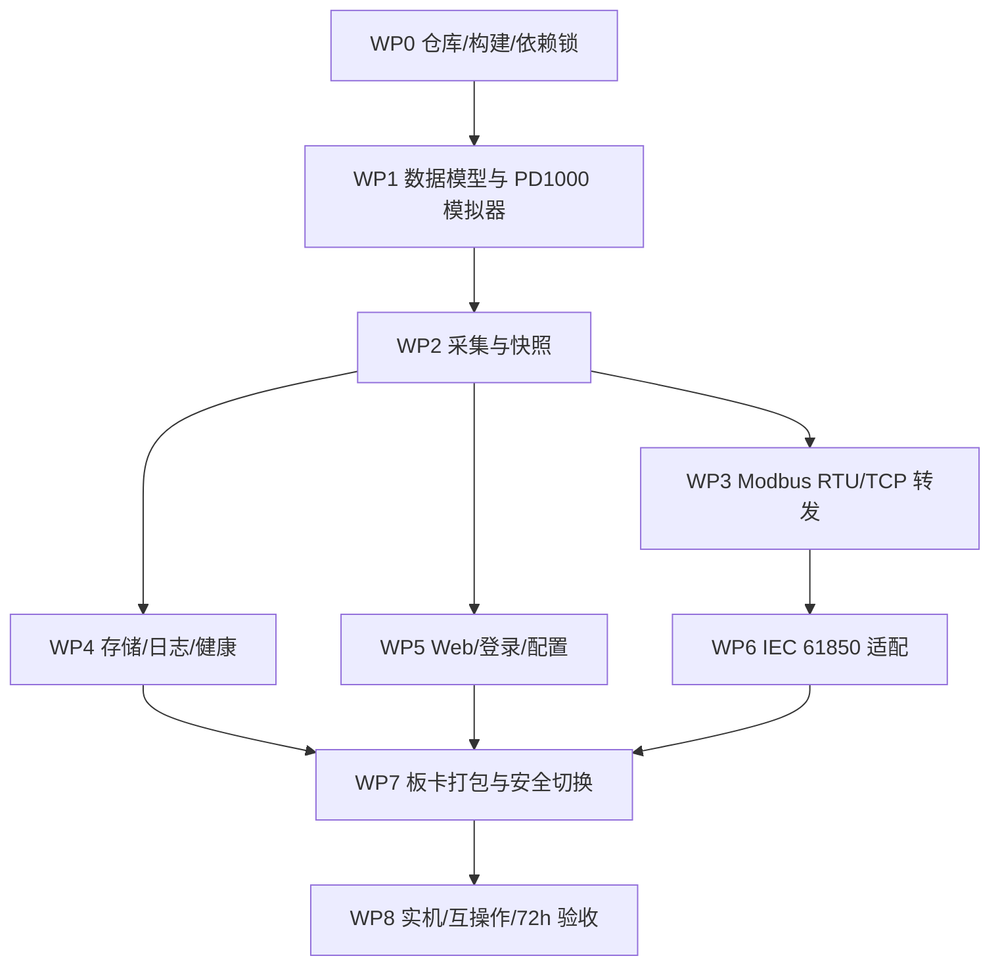

# 实施与验收计划

本计划供后续 Luna Max 实现使用。每个工作包都必须形成可运行的闭环和证据，不能以“已写代码”代替协议、故障和资源验收。

## 1. 总体顺序



IEC 许可、通用模型和 V1 事件规则已经确认。实现可以直接使用 GPLv3 版 libIEC61850；硬件接线不阻塞 host 开发，只在 WP8 做实机验收。

工作包是验收边界，不是一次提交的大小。Luna Max 按 [小步实现简报](luna-implementation-brief.md) 逐个完成可运行增量；每个增量测试通过后立即 commit 并 push，不等待整个 WP 完成。

## 2. 工作包

### WP0：仓库、构建和依赖锁

交付：

- CMake 工程、格式/静态检查、CTest、x86_64 开发构建和 aarch64 交叉构建。
- GPLv3 兼容的 `LICENSE`、源码发布说明和第三方许可证清单；发布包版本能对应到公开仓库 tag/commit。
- `third_party/manifest.json`：名称、版本/tag/commit、来源、SHA-256、许可证、启用特性。
- 禁用 CivetWeb 的 CGI/Lua/WebDAV/目录列表等非必要功能。
- 可重复的发布包目录，不要求目标板联网构建。

验收：干净环境一次命令完成 host 测试和 aarch64 构建；`readelf` 确认为 AArch64；许可证清单完整。

### WP1：领域模型与 PD1000 模拟器

交付：

- 31 项请求计划、寄存器/谱图解析、特殊值和快照类型。
- Python 伪终端 RTU 模拟器，支持正常、CRC 错、异常码、短帧、延迟、断线、逐字节慢滴、截止后迟到响应、残帧拼接、全 `0xFFBC`、局部 `0xFFBA` 和 5 值越界。
- 金样本包含 31 个请求的完整线字节，自动与需求书 CRC 表核对。

验收：所有地址边界、int16/uint16、50×72 索引、5 点质量和 3600 点 validity mask 测试通过；明确证明 `0xFFBA` 不会被当作真实 -70；模拟器可重复故障脚本。

### WP2：采集与快照发布

交付：

- `AcquisitionEngine` 独占串口、单调时钟调度、正常路径 1.75 ms 帧间静默、完整响应 timeout、安全分类重试、残帧隔离和 6 秒硬截止；libmodbus byte timeout 为 0、error recovery 为 NONE。
- 不可变 `SnapshotStore` 只在 31 块传输完整后发布 `good/degraded/not_refreshed` 载荷；独立 `AcquisitionStatus` 提供 `fresh/stale/invalid`，二者原子组成 ServingView；含 5 点质量和谱图 mask。
- 结构化计数器和节流日志。

验收：

- 10,000 个模拟正常轮次无混合快照，P99 ≤ 2 秒。
- 注入每种故障时不发布半轮；状态矩阵覆盖 good/degraded/not_refreshed × fresh/stale 及无快照 invalid，并锁定全 `0xFFBC` 与测量点 invalid 并存时的优先级。完整异常/CRC 错可安全重试；超时/短帧立即结束轮次并进入连续 6 秒隔离静默窗，迟到字节重置计时，恢复后首帧不接收上一轮残帧。
- host 定时断言与实机逻辑分析仪都证明 31 个正常请求之间响应后空闲 ≥1.75 ms；150 ms、6 秒边界及超长迟到注入得到确定状态和计数。
- ThreadSanitizer/AddressSanitizer 的 host 测试无发现。

### WP3：Modbus RTU 与 TCP 转发

交付：

- ttyS4 RTU 从站和 eth0 TCP 从站，输入寄存器起点 10001、长度 3615。
- `0x04` 正常响应、非法功能/地址/无快照异常、连接和请求限额；Modbus/TCP Unit ID 独立配置并对错配返回 `0x0B`。
- 两服务从同一 generation 读取，但使用独立可变映射。

验收：

- 对 10001、10005、10006、10016、跨块范围和 13615 做边界测试；10000 明确返回非法地址并在集成文档说明显示地址差一规则。
- 逐项对比下位机金样本与 RTU/TCP 返回的 3615 个原始寄存器。
- TCP Unit ID 1–247 边界、0 和错配行为与客户 SCADA 互操作一致；16 个 TCP 慢/断连接以及 RTU 噪声不影响采集周期。

### WP4：日志、数据、清理和健康

交付：

- syslog 结构化事件、rsyslog 规则、logrotate 规则、Web 内存环形日志摘要。
- 版本化二进制帧、CRC、原子写、CSV 流式导出、上限 64 帧/1 MiB 的周期/触发队列和可观测丢弃策略。
- V1 两类事件状态机：强放电 -45/-50 dBm 触发/重新布防，突变相邻有效峰值差 ≥10 dB；事件包保存前 2、当前、后 3 帧，同类 60 秒内合并且总帧数有界。
- TTL 和带滞回的磁盘水位清理；明确保护当前临时文件、最新帧和非数据目录；采集、协议、磁盘、时钟和资源健康聚合。
- systemd watchdog 通知，但不打开板卡 `/dev/watchdog`。

验收：分别覆盖强放电、突变、同轮双 reason、回差重新布防、无效状态跳过且保留上一次有效峰值、首次有效值仅建基线、前帧不足、后帧 30 秒超时和 60 秒合并；事件风暴下每包最多 6 帧、队列/RSS 有界。日志 7 天/大小轮转、损坏帧拒绝、磁盘低于 `max(storage.min_free_bytes,10%)` 后清到恢复水位、删除失败停止新写但不影响采集均通过。

### WP5：Web、登录和配置

交付：

- 登录/首次改密/登出/限速/会话/CSRF/再认证；产品默认 HTTPS、自签名首次接入、用户证书原子替换/回滚和本机限定的 HTTP 恢复模式。
- 总览、PRPD/PRPS、通信、网络、IEC、存储、日志、健康、安全维护页面。
- REST/WS API、schema 版本、`If-Match` 乐观并发、原子配置写和脱敏导出。
- 独立 root `uhf-privileged.service`：经 peer-credential Unix socket 提供持久化 network stage/confirm/rollback 和固定 maintenance 枚举动作；独立 rollback timer/helper 与早期 boot recovery 不依赖该服务存活；主服务保持 NNP，不调用 sudo/setuid。
- 网络 schema/MA35D1 backend 同时覆盖 static 和 DHCP；DHCP stage 用受控 `dhclient` hook 在 15 秒内取得候选租约，不替换旧默认路由，页面返回实际候选地址；确认和回滚同步适配板上 `/etc/net.conf`、`/etc/net2.conf`，由现有 `/etc/htnet/ifconfig-*` 脚本继续加载。

验收：

- 未登录、错误密码、过期会话、所有修改路由缺 CSRF、旧配置版本、恶意 IP/端口/IED 名、路径穿越全部失败关闭；证书/私钥不匹配、过期、错误 SAN、超限和热重载失败保持旧 HTTPS 可用且不泄露私钥。
- 静态/DHCP stage 同时保留旧地址/路由和新辅助地址；DHCP 无服务器、NAK、续租和地址变化均有测试。候选地址应用完成后开始 60 秒 `CLOCK_BOOTTIME` 截止；主服务/特权服务被 kill 或 crash-loop 时，独立 systemd rollback timer 仍按原截止执行，RTC/NTP 跳变不影响，boot ID 改变或事务损坏由早期 recovery 在网络服务前立即回滚；confirm 先持久化 `confirming` 状态，断电恢复时连同 DHCP 旧租约回滚到旧配置，完成后才清理事务；frpc/4G 进程始终在运行。
- 断开 WebSocket 后恢复；跨站 `Origin` 握手被拒绝；4 个 WS 慢客户端只保留最新 generation，队列与 3600 点消息大小有界；页面离线无 CDN 请求。

### WP6：IEC 61850

采用已确认的 GPLv3 开源路径和通用模型，不等待客户 ICD/CID。

交付：

- `IIec61850Server` 适配层、libIEC61850 1.6.2 实现和可复现 SCL/ICD 生成流程。
- 5 个值、质量、时间戳的原子更新；客户端断开不影响其他模块。
- 固定 `LLN0 + LPHD1 + SPDC1 + GGIO1`；标准 `SPDC1.UhfPaDsch/PaDschAlm`、GGIO 五值、一个静态数据集和一个 URCB；网页显示实际数据引用。
- 固定资源配置：4 连接、16 KiB MMS PDU、每连接 2 outstanding/64 KiB pending、适配层 8 MiB；BER 深度 32、单请求 512 元素，未批准服务关闭。

验收：

- 官方/客户客户端可连接、浏览、读取并观察新 generation。
- stale/invalid/not_refreshed 映射到批准的质量位。
- 验证 URCB 数据变化、60 秒完整性周期、断线后重新订阅；确认 BRCB/控制/写/GOOSE/SV/文件/动态数据集均未启用。
- 超大/深层/畸形 BER、第五连接、第三 outstanding、慢读和报告风暴被拒绝或断关联，RSS/队列有界且分类计数可见；协议栈无法强制任一界限则 WP6 不通过。
- 公开仓库 tag、源码包、二进制版本和第三方许可证能够互相对应。

### WP7：板卡打包、安全加固与切换

交付：

- 版本目录、current/previous、显式回退、systemd restart/start-limit/watchdog、用户/组、capability、rsyslog/logrotate、配置迁移和回滚。
- 安装前检查 502/102/8080、ttyS1/ttyS4、磁盘、架构、NTP、受保护进程。
- 备份 root crontab并只精确禁用 `/data/run.sh` 那一行，验证其他条目未变；只停止工作目录为 `/data` 的旧 Web.py/Main.py；首次切换保留受控 legacy recovery unit，安装成功后清除恢复标记，后续升级只做显式回退。
- 首次默认管理员密码为 `admin`，管理员可在登录后主动改密。

验收：安装、显式回退、损坏配置、连续崩溃、断电后启动、整机重启；首次切换可恢复 legacy；frpc、4G、sysrst/watchdog 不受影响。

### WP8：实机和长期验收

交付：协议测试记录、资源曲线、72 小时报告、开放风险和发布清单。

验收：

- 真实 PD1000 完成 10,000 轮和异常断线恢复。
- 485-4 与 Modbus/TCP 全寄存器对比。
- IEC 61850 客户模型互操作。
- 网络试应用/回滚、双网口、NTP 失步/恢复、磁盘水位。
- 72 小时满足 NFR-01…NFR-11，无 P0/P1 未解决问题。

## 3. 建议源码边界

```text
CMakeLists.txt
cmake/toolchains/aarch64-linux-gnu.cmake
config/schema.json
src/domain/                 # RequestPlan, Snapshot, parsing, quality
src/acquisition/            # Serial master and scheduler
src/modbus/                 # RTU/TCP servers and adapter
src/iec61850/               # interface, stub, licensed adapter, model
src/web/                    # REST/WS/auth/session/config handlers
src/storage/                # frame format, retention, export
src/platform/ma35d1/        # tty/network/systemd helpers only
src/health/
web/                        # offline static source and vendored chart asset
tests/unit/
tests/integration/
tools/pd1000-sim/
packaging/systemd/
packaging/rsyslog/
packaging/logrotate/
docs/
third_party/
```

平台特有的 `/etc/htnet`、tty 名和 root helper 只能出现在 `src/platform/ma35d1` 与 packaging 中。领域和协议测试必须能在 host 上通过伪终端/TCP 运行。

## 4. 配置默认值与范围

| 配置 | 默认 | 验证/生效 |
|---|---:|---|
| acquisition.device | `/dev/ttyS1` | 允许列表；重启服务 |
| acquisition.slave_id | 1 | 1–247；热加载到下一轮 |
| acquisition.period_ms | 6000 | 产品锁定或 6000–60000；下一轮 |
| acquisition.response_timeout_ms | 150 | 50–180；保存时校验 31 次首次尝试、静默间隔和整轮截止仍相容 |
| acquisition.max_retries | 3 | 0–3；best-effort，整轮截止和后续块首次尝试优先 |
| acquisition.inter_frame_silence_us | 1750 | 产品锁定；正常/错误路径都执行 |
| acquisition.late_quarantine_ms | 6000 | 产品锁定；连续静默，任一接收字节重置 |
| rtu_server.device | `/dev/ttyS4` | 允许列表；重启服务 |
| rtu_server.unit_id | 1 | 1–247；重启该服务 |
| modbus_tcp.bind_interface | `eth0` | 只允许 eth0；重新绑定 |
| modbus_tcp.port | 502 | 1–65535，不能与其他服务重复 |
| modbus_tcp.unit_id | 1 | 1–247；错配返回 `0x0B` |
| iec61850.enabled | true | 可在网页关闭；启用时重启 IEC 服务 |
| iec61850.port | 102 | 1–65535；提示标准端口 |
| iec61850.ied_name | `UHFPD1` | IEC 合法字符/长度；重启 IEC 服务 |
| web.port | 8080 | 1024–65535；与其他服务不冲突 |
| web.tls.enabled | true | 产品构建锁定 true；仅本机 root 恢复配置可关闭 |
| network.eth0/eth1.mode | static | static/dhcp；DHCP stage 取租超时 15 秒 |
| storage.period_seconds | 300 | 60–86400 |
| storage.event_threshold_dbm | -45 | -70…15；仅 fresh/valid 峰值 |
| storage.event_rearm_dbm | -50 | 必须小于触发门限 |
| storage.event_delta_db | 10 | 1–85；当前值与上一次 fresh/valid 峰值比较，无效帧跳过 |
| storage.event_merge_seconds | 60 | 0–3600；窗口不随合并延长 |
| storage.event_pre_frames | 2 | V1 产品锁定 |
| storage.event_post_frames | 3 | V1 产品锁定；30 秒收集超时 |
| storage.retention_days | 1 | 1–30；受磁盘水位优先级覆盖 |
| storage.min_free_bytes | 536870912 | ≥ 256 MiB；与 10% 取大者，恢复点再加 256 MiB 或取 15% |
| logging.level | INFO | DEBUG/INFO/WARN/ERROR |

端口保存前先尝试绑定或检查冲突；不能保存一个会使所有管理入口同时不可用的配置。

## 5. 测试矩阵

| 层 | 必测 |
|---|---|
| 纯单元 | CRC、31 项计划、字节序、int16、特殊值、索引、双轴状态矩阵、配置、密码、会话、证书校验、帧 CRC、清理排序/滞回/保护集 |
| 组件 | PTY RTU 主站、PTY RTU 从站、TCP 多连接、快照并发、WS、日志节流、原子配置 |
| 故障注入 | CRC 错、短帧、异常码、慢滴/迟到/残帧与隔离重置、串口拔线、端口占用、MMS 超大/深层 BER、客户端慢读、队列满、磁盘满、只读文件系统、NTP/RTC 跳变、DHCP 无服务/NAK |
| 安全 | 未认证、暴力登录、每个修改路由 CSRF、会话固定/重放、证书替换/回滚、路径穿越、命令注入、恶意日志、超大 JSON/WS、危险 GET |
| 板卡 | ttyS1/ttyS4 方向、eth0/eth1、端口 102/502、重启、掉电、frp/4G 共存、资源限制 |
| 互操作 | Modbus 抓包/全地址、客户 IEC 客户端/ICD、浏览器桌面和窄屏 |
| 长稳 | 72 小时、10,000 轮、连接抖动、事件风暴、日志/数据轮转、升级回滚 |

## 6. 发布门槛

不得发布的条件：

- 任何未解决的 P0/P1；采集会发布半轮或超过 6 秒不返回。
- 公开源码/tag、GPLv3 许可证和固件版本无法对应，或 IEC ICD 与运行模型不一致。
- 登录、CSRF、Unix socket peer credential、网络崩溃/重启回滚或 root 特权服务的负向测试未通过。
- RSS > 80 MiB、出现持续增长，或磁盘会无限增长。
- 实机未证明 ttyS1/ttyS4 映射和 31 个请求。
- 安装/升级会停止或覆盖 frpc、4G、sysrst/watchdog。
- 任一客户端/队列可以无界增长，或过载丢弃没有计数、健康告警和测试。

## 7. 给 Luna Max 的执行约束

1. 先阅读 `luna-implementation-brief.md`；当前增量需要细节时再查需求基线、架构、机器评估、完整验收计划和两个源材料。
2. 不需要重新论证已确认架构；每次只实现一个小而完整的功能增量，保持构建和测试通过，然后立即 commit、push。禁止把多个 WP 堆成一个大提交，也禁止提交不能构建的中间状态。
3. 不在目标机直接开发，不清理 `/data`，不修改 frpc/4G；没有到 WP7 不停止旧服务。
4. 不提交 SSH/Git 密钥、密码、目标机配置备份、真实日志或客户 ICD/CID 中的受限内容。
5. 工业协议输入一律视为不可信；长度、范围、状态和截止时间先验证再使用。
6. 依赖必须固定并审计许可证；libIEC61850 使用 1.6.2 GPLv3 路径，项目和发布材料保持 GPLv3 兼容。
7. 每个生产模块必须有失败路径测试；只有模拟器 happy path 不算完成。
8. 最终接受由实机证据决定，不由模型自评、代码行数或编译成功决定。
9. 直接在 `main` 做小步提交并推送，不 force-push、不改写已发布历史；遇到外部门槛时停在最近一个完整、测试通过的提交。
